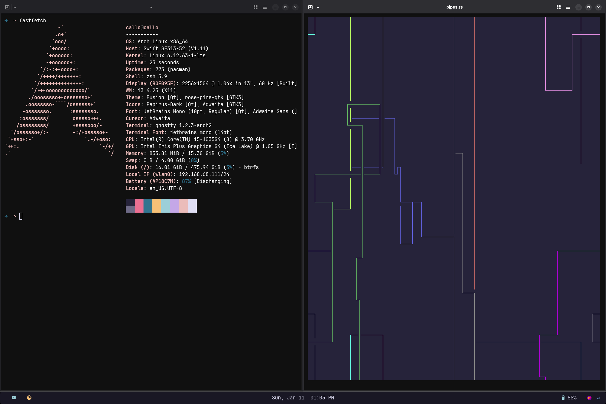

# i3 Rice Dotfiles
This repository contains my personal configuration files (dotfiles) for i3
tools I use. This configurations help me maintain a consistent and efficient
working environment across different machines, featuring a minimalist design
to focus on productivity and work.

> A work focused Arch Linux rice to avoid distractions and help get work done

> After ricing in hyprland and going to campus, I have discovered that my 
grandfather in bed lasts longer than the battery life of this pre owned laptop
which became the focus of this rice rather than making it beautiful, it is now
focused on battery life and removing as much background processes as much as I
can.

## Desktop Preview


## Theme Overview
* **Color Palette**: [Rose Pine](https://github.com/rose-pine/neovim)
* **Window Manger**: [i3](https://github.com/i3/i3)
* **Status Bar**: [Polybar](https://github.com/i3/i3)

## What's Included

- **i3** - A tiling window manager for X11
- **Polybar** -  A fast and easy-to-use status bar
- **Rofi** - A window switcher, application launcher and dmenu replacement
- **dunst** - A lightweight and customizable notification daemon

## Quick Start

1. **Clone the repository:**
   ```bash
   git clone https://github.com/Floranaras/dotfiles-i3.git ~/.dotfiles-i3
   cd ~/.dotfiles-i3
   ```

2. **Install prerequisites:** 
    ```bash
    # Core dependencies
    sudo pacman -S git stow i3 polybar rofi dunst i3lock

    # Nerd fonts for Global Fonts
    sudo pacman -S ttf-nerd-fonts-symbols-mono ttf-jetbrains-mono-nerd
    ```
3. **Use stow to create symbolic links:**
   ```bash
   stow i3 polybar rofi dunst i3lock
   ```
4. **First-time setup:**
    Press `Mod+Shift+R` or logout and login again


